<!-- Header Banner with Typing Animation -->

  

<!-- Animated Typing -->

  

 

<!-- Profile Views & Social Badges -->

  
  
  
  

 

---

<!-- About Me Section -->
## 👨‍💻 About Me

  🎓 <b>Computer Science Student</b> passionate about building things that live on the internet  
  🚀 I love turning complex problems into simple, beautiful and intuitive solutions  
  🤖 Currently exploring <b>Machine Learning</b>, <b>Computer Vision</b> & <b>System Design</b>  
  🌱 Always learning new technologies and contributing to <b>Open Source</b>  
  💡 Fun fact: <i>"I debug with console.log and I'm proud of it 😄"</i>  
  📍 Based in <b>India</b> 🇮🇳

 

---

<!-- Tech Stack -->
## 🛠️ Tech Stack & Tools

<table>
<tr>
<td align="center" width="50%">

**💻 Languages**

</td>
<td align="center" width="50%">

**🧩 Frameworks & Libraries**

</td>
</tr>
<tr>
<td align="center" width="50%">

**🗄️ Databases & Cloud**

</td>
<td align="center" width="50%">

**🔧 Tools & Platforms**

</td>
</tr>
</table>

**🤖 ML / Data Science**

  
  
  
  
  
  

---

<!-- Featured Projects -->
## 🚀 Featured Projects

<table>
<tr>
<td width="50%" valign="top">

<h3 align="center"><a href="https://github.com/Ashutosh-kumar-06/Budgety-bud">💰 Budgety-Bud</a></h3>

<b>Personal Finance & Wellness App</b>

  
  
  

</td>
<td width="50%" valign="top">

<h3 align="center"><a href="https://github.com/Ashutosh-kumar-06/StayNest-Home-Rental-Marketplace">🏠 StayNest Marketplace</a></h3>

<b>Property Rental Platform</b>

  
  
  

</td>
</tr>
<tr>
<td width="50%" valign="top">

<h3 align="center"><a href="https://github.com/Ashutosh-kumar-06/Page-Replacement-Algorithm-Simulator">📊 Page Replacement Simulator</a></h3>

<b>OS Algorithm Visualizer</b> ⭐ 1 · 🍴 2

  
  
  

</td>
<td width="50%" valign="top">

<h3 align="center"><a href="https://github.com/Ashutosh-kumar-06/deduplix-price-list">🔍 Deduplix Price List</a></h3>

<b>Intelligent Duplicate Detector</b> ⭐ 1

  
  
  

</td>
</tr>
</table>

---

<!-- ML Projects Section -->
## 🤖 Machine Learning Projects

<table>
<tr>
<td width="33%" align="center" valign="top">

<h3>🏡 House Price Predictor</h3>

  

Linear Regression model to predict house prices using key features

  <code>Python</code> <code>Scikit-learn</code> <code>Pandas</code>

</td>
<td width="33%" align="center" valign="top">

<h3>👥 Customer Segmentation</h3>

  

K-Means clustering to segment retail customers by purchase history

  <code>Python</code> <code>K-Means</code> <code>Data Analysis</code>

</td>
<td width="33%" align="center" valign="top">

<h3>👁️ OpenCV Practice</h3>

  

Hands-on exploration of Computer Vision tools and techniques

  <code>Python</code> <code>OpenCV</code> <code>Image Processing</code>

</td>
</tr>
</table>

---

<!-- GitHub Stats Section -->
## 📊 GitHub Analytics & Activity

  

    
    
  

   

  

    
    
  

   

  

    
  

---

<!-- LeetCode Stats Section -->
## 🧠 Competitive Programming & DSA

  

---

<!-- Skills Progress Bars -->
## 📈 Skill Proficiency

  <table>
    <tr>
      <td align="left" width="50%">
        <b>JavaScript / TypeScript</b>
         
        <code>██████████████████░░░░░░</code> <b>75%</b>
      </td>
      <td align="left" width="50%">
        <b>HTML / CSS</b>
         
        <code>██████████████████████░░</code> <b>90%</b>
      </td>
    </tr>
    <tr>
      <td align="left" width="50%">
        <b>React / Next.js</b>
         
        <code>████████████████░░░░░░░░</code> <b>65%</b>
      </td>
      <td align="left" width="50%">
        <b>Node.js / Express</b>
         
        <code>████████████████░░░░░░░░</code> <b>65%</b>
      </td>
    </tr>
    <tr>
      <td align="left" width="50%">
        <b>Python / ML</b>
         
        <code>██████████████░░░░░░░░░░</code> <b>60%</b>
      </td>
      <td align="left" width="50%">
        <b>MongoDB</b>
         
        <code>██████████████░░░░░░░░░░</code> <b>60%</b>
      </td>
    </tr>
    <tr>
      <td align="left" width="50%">
        <b>Git / GitHub</b>
         
        <code>████████████████████░░░░</code> <b>80%</b>
      </td>
      <td align="left" width="50%">
        <b>Socket.io / WebSockets</b>
         
        <code>██████████████░░░░░░░░░░</code> <b>55%</b>
      </td>
    </tr>
    <tr>
      <td align="left" width="50%">
        <b>C / C++</b>
         
        <code>████████████░░░░░░░░░░░░</code> <b>50%</b>
      </td>
      <td align="left" width="50%">
        <b>Docker / DevOps</b>
         
        <code>████████░░░░░░░░░░░░░░░░</code> <b>35%</b>
      </td>
    </tr>
  </table>

---

<!-- What I'm working on -->
## 🔭 What I'm Currently Working On

| 🎯 Goal | 📌 Status | 🔗 Link |
|---------|-----------|---------|
| Building scalable full-stack applications | 🟢 Active | [Budgety-Bud](https://github.com/Ashutosh-kumar-06/Budgety-bud) |
| Exploring advanced ML & Deep Learning | 🟡 Learning | [ML Projects](https://github.com/Ashutosh-kumar-06/Prodigy-ml-01) |
| Contributing to Open Source | 🟢 Active | [TheAlgorithms C++](https://github.com/Ashutosh-kumar-06/TheAlgorithms_C-Plus-Plus) |
| System Design & Architecture | 🟡 Learning | — |
| Real-time systems with WebSockets | 🟢 Active | [Device Tracker](https://github.com/Ashutosh-kumar-06/real-time-device-tracker) |

---

<!-- Random Dev Quote -->
## 💭 Dev Quote of the Day

  

---

<!-- Connect Section -->
## 🤝 Let's Connect!

  
  
  
  

 

  

 

<!-- Contribution Snake Animation -->

  <picture>
    <source media="(prefers-color-scheme: dark)" srcset="https://raw.githubusercontent.com/Ashutosh-kumar-06/Ashutosh-kumar-06/output/github-snake-dark.svg" />
    <source media="(prefers-color-scheme: light)" srcset="https://raw.githubusercontent.com/Ashutosh-kumar-06/Ashutosh-kumar-06/output/github-snake.svg" />
    
  </picture>

---

<!-- Footer Wave -->

  ⭐ Star my repos if you find them useful! • Built with ❤️ by <a href="https://github.com/Ashutosh-kumar-06">Ashutosh Kumar</a>

